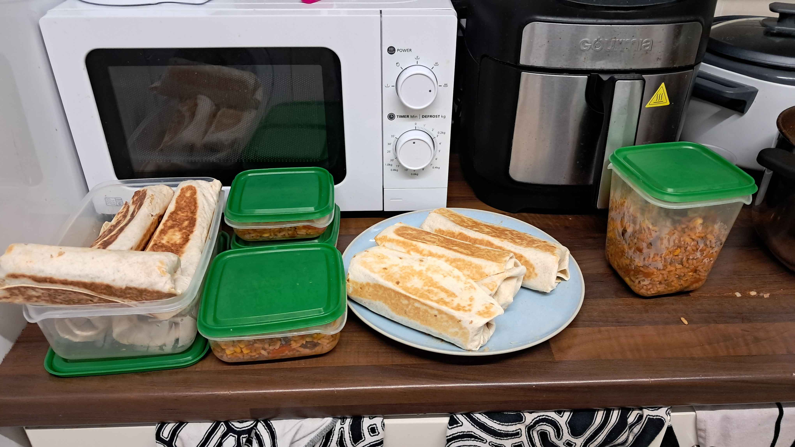

# Burritos - heavy duty meal prep edition

- serves >10
- 4 hours

## ingredients

- 4 cups rice
- 500g mince
- 1 onion
- garlic
- 1 tin kidney beans
- 1 tin sweetcorn
- 2 carrots
- 1 pepper
- 500ml vegetable stock
- tomato paste
- cayenne pepper
- salt & pepper
- tortillas
- cheese
- hot sauce
- oil

## prep
1. begin frying mince in oil in pot until brown.
2. dice onion, garlic, carrot and pepper and add to mince
3. cook until onion softens.
4. add chopped tomato, sweetcorn and kidney beans into mixture
5. cook until bubblig
6. prepare stock and add tomato paste, cayenne pepper and salt & pepper to the jug to taste.
7. add mixture to mince
8. let simmer until excess water boils off (takes awhile, ladle away excess after an hour if you cant be bothered to wait)
9. cook rice and add to mixture, fully incorporating

The mix is ready! You can box it up for later or use it immeadiately. It will last for at least 4 days in the fridge. When defrosting, either:
- use a fridge and reheat individual bits of mix as you use it
- use a microwave and cook & eat all burritos now.

It is best to freeze in small separate quantities to not be overwhelmed or poisoned.

## cook
1. heat up frying pan to med-high heat and add a little oil
2. place a tortilla on plate and add 2-3 spoonfuls of burrito mix in a rectangle in the centre with gaps on either side
3. (optional) grate cheese onto wrap
4. (optional) add hot sauce to wrap
5. (optional) put literally anything else you want in there. Chillis, lao gan ma, lettuce, go with your heart!
6. fold the sides of the wraps towards to centre so that the edge of the rectangle is at the end of the wrap
7. fold the bottom of the wrap up so it meets the top of the rectangle.
8. roll the tortilla upwards __tight__ keeping the sides in without splitting the tortilla.
9. place the burrito seal-side down into the pan and fry off for about a minute or until golden
10. flip burrito to crisp other sides of the burrito to your liking. I like mine crispy as seen above!

Repeat steps 2 to 10 until desired amount of burritos created or burrito mix supply depleted, occaisionally adding more oil to the pan

## serve
Plate up your burritos and enjoy. 1 for lunch, 2 for dinner or 3 for big hungry dinner. Best to have three on the day you've cooked them
### enjoy! ^_^

---

*recipe thanks to Aoibhe*
