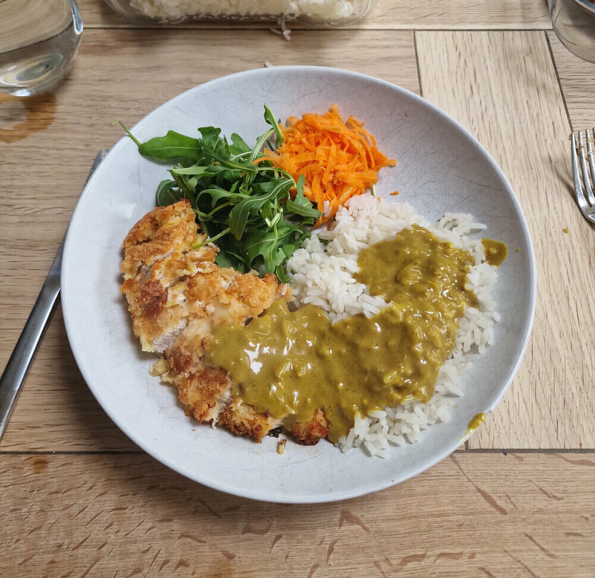

# Chicken katsu curry

- serves 4
- 1 hour

## ingredients

- 2 onions
- 4 - 6 chicken breasts
- garlic (2 cloves or a few scoops from jar)
- ginger
- tumeric
- mild curry powder
- plain flour
- 3 eggs
- panko breadcrumbs
- chicken or vegetable stock cube
- 200ml coconut milk
- soy sauce
- sugar and salt
- cooking oil
- rice

## prep

1. finely chop onion
2. finely chop garlic
3. finely grate ginger

## cook

1. put a medium saucepan on medium heat with some cooking oil
2. add the onion, garlic, 2 teaspoons ginger, and cook gently until softened
3. add 2 teaspoons tumeric and 2 tablespoons mild curry powder
4. cook the spices in for 5 minutes
5. add 2 heaped tablespoons of plain flour, and cook for a few more minutes
6. add 1 stock cube to ~500ml hot water. slowly pour this into the saucepan
7. add the coconut milk
8. add a splash of soy sauce and a scoop of sugar

let simmer while you prep and cook the chicken

## chicken

1. pour some plain flour into the bottom of a bowl
2. whisk three eggs in a second bowl
3. pour some panko breadcrumbs into a third bowl
4. take each each chicken breast, then coat it in flour
5. then coat it in egg
6. then coat it in panko breadcrumbs
7. set the breasts aside

## shallow fry

1. pour enough oil into a large frying pan to cover more than half a chicken breast
2. put it on medium to high heat

wait for the oil to heat up. you can test its ready by throwing in a breadcrumb
- if it sinks, the oil is too cold
- if it burns, the oil is too hot
- if it floats and bubbles, the oil is ready!

now is a good time to start boiling water for the rice!

3. place each of the chicken breasts into the oil
4. you should have enough space to fit all of them in - keep an eye on them and flip then over when golden brown
5. you'll need to cook them more than you think, as you don't want the chicken to be raw in the middle
6. when they're done, cut the thickest breast in half to check if it's pink in the middle
7. place each chicken breast on a plate with a paper towl to absorb the excess water
8. slice each breast into thin strips

## serve

serve with a portion of rice, a large serving of katsu sauce, and a chicken breast or two! you can add peashoots or salad if you like

### enjoy! ^_^

---

*recipe modified from wagamamas' katsu curry*