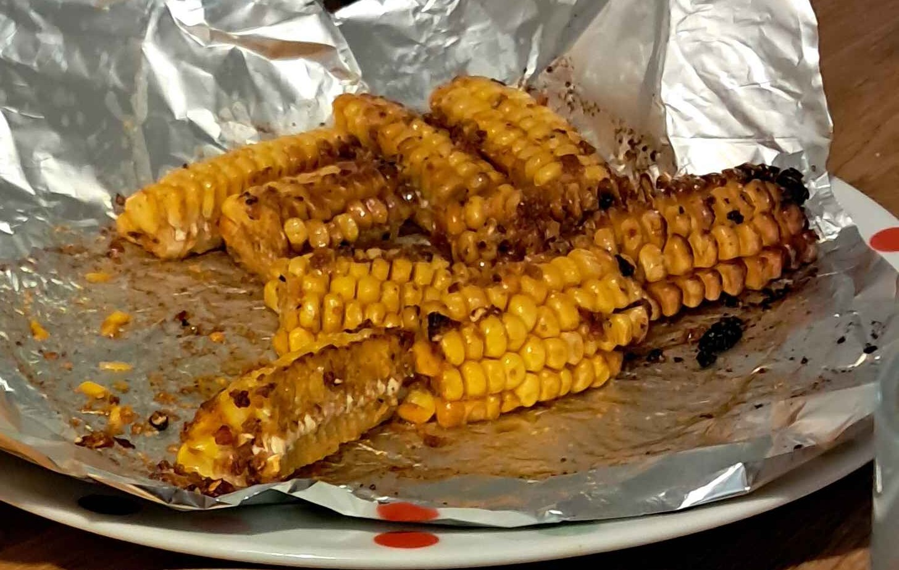

# Corn ribs

- serves 2
- 30 mins

## ingredients

- 2 corn on the cob
- olive oil
- paprika
- chilli flakes
- hot sauce
- any cajun spices
- butter (or alternative)

## prep
1. preheat oven to 200 degrees fan (or use an air-fryer later)
2. boil corn in water for 10-12 minutes
3. pour olive oil into small bowl until half full (enough to submerge half a corn in).
4. add all spices to the oil and mix together until fully combined.
5. remove corn from boiling water and __wait for it to cool__
6. cut corn lengthways into quarters or eights (please be careful!)

## cook

1. submerge each corn piece in oil mixture until fully coated
2. place together in foil
3. cook for 7.5 minutes in airfryer or preheated oven.
4. give them a shake halfway through
5. cook for 7.5 minutes more.
6. melt butter in bowl that used to have oil mixture in it.

## serve

remove from oven/airfryer, pour flavoured melted butter over the top and let cool slightly before eating
- best while hot and a little charred
- keeps well for 1 day.

### enjoy! ^_^

---

*recipe thanks to Luke's dad*
