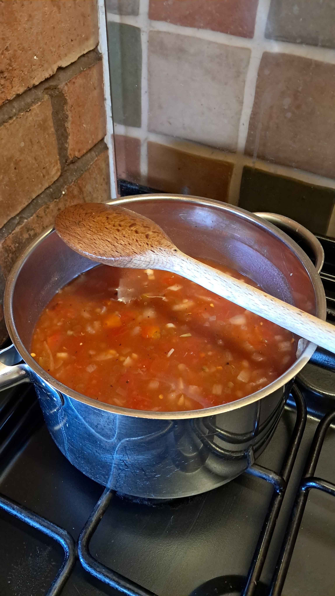

# Lentil soup

- serves 4
- 30 mins

## ingredients

- 1 tin green lentils
- 2 tins chopped tomato
- 2 onions
- as many cloves of garlic as you want
- handful of basil
- 800ml vegetable stock
- salt & pepper
- oil

### optional extra spices
- paprika
- cayenne pepper
- chilli flakes

## cook

1. drain and lightly simmer the lentils under a couple centimetres of water 
2. dice onions and begin frying in oil in pot over a medium heat
3. dice garlic and stalks of some basil and add when onions are golden
4. add the chopped tomatoes and stir
5. add the lentils & vegetable stock and stir
6. simmer for 5 minutes
7. Add salt, pepper, paprika & any optional spices to taste how you want.
8. simmer for 5 minutes 

## serve

At this poiint you can either blend it together or not, depending on your feelings about texture

- 2-3 ladles per bowl
- top with basil leaves
- eat now or store in fridge and reheat later, keeps well.

### enjoy! ^_^

---

*recipe thanks to my dad*
