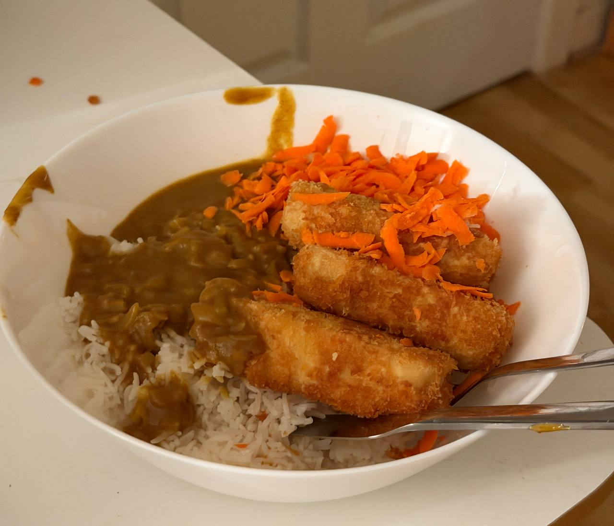

# Tofu katsu curry

- serves 4
- 1 hour

## ingredients

- 2 onions
- 4 - 6 blocks extra firm tofu (i recommend smoked)
- garlic (2 cloves or a few scoops from jar)
- ginger
- tumeric
- mild curry powder
- plain flour
- 3 eggs
- panko breadcrumbs
- vegetable stock cube
- 200ml coconut milk
- soy sauce
- sugar and salt
- cooking oil
- rice

## prep sauce

1. finely chop onion
2. finely chop garlic
3. finely grate ginger

## cook

1. put a medium saucepan on medium heat with some cooking oil
2. add the onion, garlic, 2 teaspoons ginger, and cook gently until softened
3. add 2 teaspoons tumeric and 3 tablespoons mild curry powder
4. cook the spices in for 5 minutes
5. add 2 heaped tablespoons of plain flour, and cook for a few more minutes
6. add 1 stock cube to ~500ml hot water. slowly pour this into the saucepan
7. add the coconut milk
8. add a splash of soy sauce and a scoop of sugar

let simmer while you prep and cook the tofu

## prep tofu

1. drain the tofu packets and remove the blocks
2. press the tofu gently between two paper towels
3. replace the paper towels and repeat until the towels aren't soaked

make sure you don't crush or crumble the tofu!

4. slice the blocks into "fish finger" sized strips. three per block is about right

## bread tofu

1. pour some plain flour into a bowl
2. whisk three eggs in a second bowl
3. pour some panko breadcrumbs into a third bowl
4. take each each tofu finger, then coat it in flour
5. then coat it in egg
6. then coat it in panko breadcrumbs
7. set the fingers aside

## shallow fry

1. pour enough oil into a large frying pan to cover more than half a tofu fingers
2. put it on medium to high heat

wait for the oil to heat up. you can test its ready by throwing in a breadcrumb
- if it sinks, the oil is too cold
- if it burns, the oil is too hot
- if it floats and bubbles, the oil is ready!

now is a good time to start boiling water for the rice!

3. place each of the tofu fingers into the oil
4. you should have enough space to fit all of them in - keep an eye on them and flip then over when golden brown
5. the tofu should be heated through quickly - keep frying until they reach your desired crispiness
6. place each tofu finger on a plate with a paper towl to absorb the excess water

## serve

serve with a portion of rice, a large serving of katsu sauce, and a few tofu fingers! you can add peashoots or salad if you like

### enjoy! ^_^

---

*recipe modified from wagamamas' katsu curry*