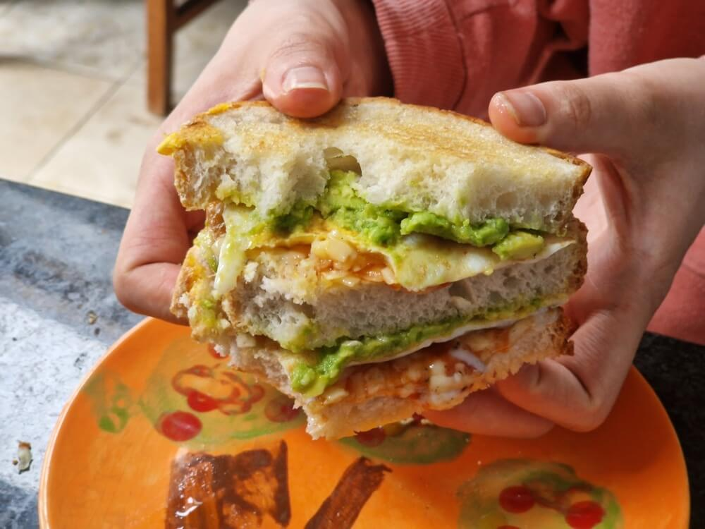

# Triple fried egg and avocado sandwich

- serves 1
- 5 minutes

## ingredients

- 3 slices tiger loaf
- 1 avocado
- 2 eggs
- cheddar cheese
- sweet chilli jam / sauce
- butter 
- cooking oil
- black pepper

## prep

1. cut the avocado in half, and scoop out into a bowl
2. smash the avocado with a fork, until soft and spreadable
3. butter three slices of bread - butter both sides of one slice
4. get the napkins ready (she's going to be a messy one)

## cook

1. add a little cooking oil to frying pan on low-medium heat 
2. crack two eggs into the pan, being careful not to break the yolks
3. fry the eggs gently, using a spatula to keep the white together
4. make sure the eggs don't stick to the pan, and the white is cooked fully (tip: use a small spoon to scoop hot oil over the top of the egg!)

## serve

1. spread half the smashed avocado to one slice of bread
2. add a generous amount of sweet chilli sauce
3. grind black pepper over the avocado, to your taste
4. place the fried egg over the top of the avocado and sauce
5. grate cheddar cheese over the egg, to your taste
6. now add the double-buttered bread slice
7. repeat steps 1 to 5 with the rest of the avocado, chilli sauce and second egg
8. finally add the last slice of bread, and serve!

### enjoy! ^_^

---

*recipe modified with thanks to Dave Lister, 3rd Technician aboard the JMC mining ship the Red Dwarf*